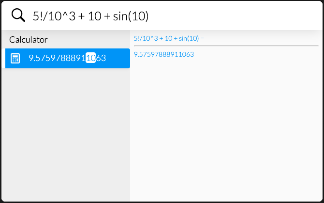

# LaunchMenu-calculator applet

A simple calculator in LaunchMenu. This applet is still a work in progress. Current functionality uses custom interpreter to parse and evaluate mathematical expressions. Feature list can be found [on the megathread](https://github.com/LaunchMenu/LaunchMenu/issues/116).



## TODO

-   [x] Modulo operator
-   [ ] Seperated semantics
    -   [ ] Bracket imbalance error suggestions
-   [x] Copy action to copy result to clipboard (cmd+c/ctrl+c)
-   [x] Search pattern?
    -   [x] Consider `/^=/` like excel formula
    -   [x] ~~Consider a fast way to test if a query looks like a calculate-able query to prevent excessive parser runs (and slowdowns respective to that). Though maybe parser is fast enough?~~ We believe parser to be fast enough
-   [ ] Implement `ANS` and `M+` (save as variable)
    -   [ ] Consider adding variable support
-   [ ] Conversions from one unit to another (5kg `to` lb, 500m `in` miles)
    -   [ ] Unit tracking would be great

## Maybe a separate math applet?

-   [ ] Plotting?
-   [ ] Integrals and Derivatives?

### Error suggestions:

```
Query: "123+224+423+3124)/4"
Suggestions: [
  "(123+224+423+3124)/4", //tokenAddition
  "123+(224+423+3124)/4", //tokenAddition
  "123+224+(423+3124)/4", //tokenAddition
  "123+224+423+(3124)/4", //tokenAddition
  "123+224+423+3124/4"   //tokenRemoval
]
```

Default action of these suggestions should replace search field with the calculation suggested
